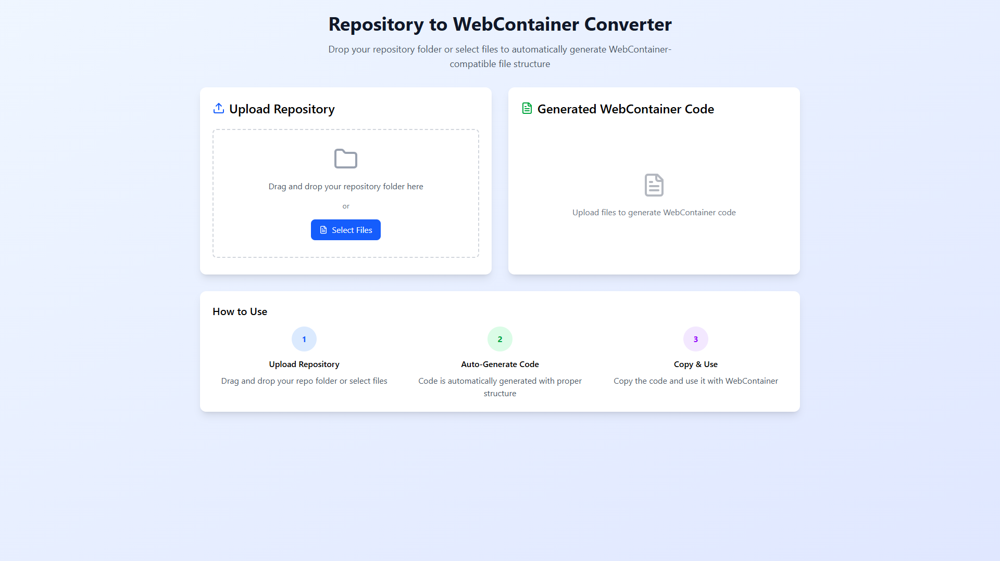

# 📦 Mount Mate


[](https://react.dev/)
[](https://www.typescriptlang.org/)
[](https://tailwindcss.com/)

[](./LICENSE)


---

A developer tool that simplifies creating WebContainer mount objects for StackBlitz's WebContainer API.


WebContainers require a specific file structure format that's tedious and error-prone to construct manually for complex projects. 

**Mount Mate** solves this by providing a clean interface that recursively analyzes your project folder and generates the properly formatted mount object. Stop wasting time on nested JSON structures and focus on what matters - building your application.


## Screenshots
<div align="center">
<figure>

<figcaption>Minimal Interface</figcaption>
</figure>
<figure>

<figcaption>JSON format generation</figcaption>
</figure>
</div>

## How It Works
1. Upload your project folder using the drag-and-drop interface
2. Mount Mate automatically analyzes the structure recursively
3. The system generates the WebContainer-compatible mount object
4. Copy or download the formatted structure for use in your StackBlitz project

This workflow eliminates the tedious process of manually constructing nested JSON structures for the WebContainer API, saving developers hours of time and reducing the risk of errors.

**Why this approach?** The WebContainer API requires a specific nested structure that looks like this:

```javascript
{
  'file1.txt': {
    file: { contents: '...' }
  },
  'folder': {
    directory: {
      'file2.txt': {
        file: { contents: '...' }
      }
    }
  }
}
```
Most developers struggle with this structure because:

- It requires deep nesting for directory structures
- File contents need to be properly escaped
- You need to correctly distinguish between files and directories

What makes Mount Mate special is its intelligent structure conversion. Instead of forcing developers to manually create this nested JSON, it:

1. Identifies all files and directories recursively
2. Converts paths to the proper structure format
3. Handles edge cases like hidden files and build artifacts
4. Provides validation to prevent common errors

This approach ensures that developers can focus on building their applications, not wrestling with API formats.

## Features

### ✨ Project Upload
- Drag-and-drop interface for uploading project folders
- Automatic folder analysis with progress indicators

### 📁 Structure Generation
- Recursively scans all files and directories
- Converts folder structure to WebContainer mount object
- Ignores build files and packages (like node_modules)

### 💾 Export Options
- Copy formatted object to clipboard
- Download as JSON file
- Clear and well-structured format for easy integration

### 🛠️ Developer Experience
- Error handling for unsupported file types
- Full TypeScript support with proper type definitions
- Clean, responsive UI built with Tailwind CSS

## Tech Stack
### Frontend
- React 18 with TypeScript 
- Vite for fast development and builds
- Tailwind CSS for styling - Utility-first CSS framework for rapid UI development
- File System APIs - For local file access and processing

### Tooling

- TypeScript
- ESLint
- Prettier

## Environment Variables
This project doesn't require any environment variables. It's designed to run locally without any configuration.

## License
MIT License

© 2025 Gadangi Sainag ☺️

If you find this tool helpful, please consider giving a ⭐️ on GitHub.